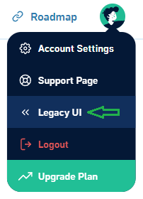
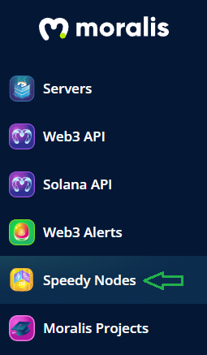
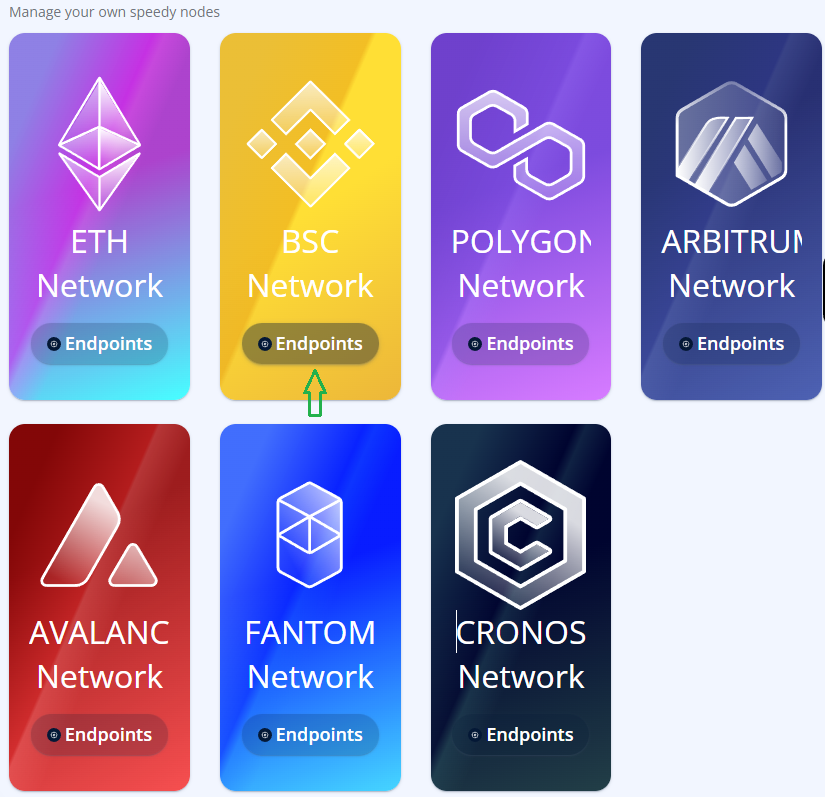
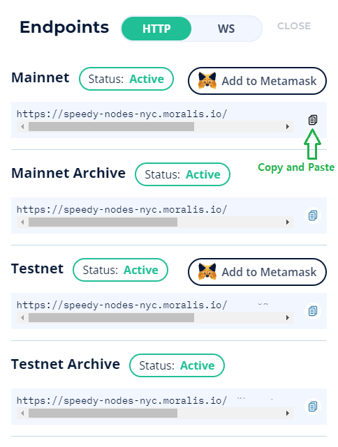
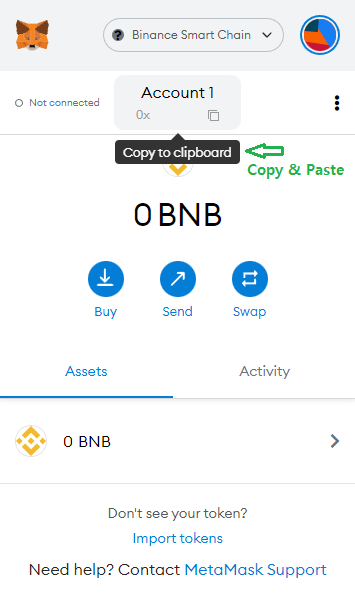
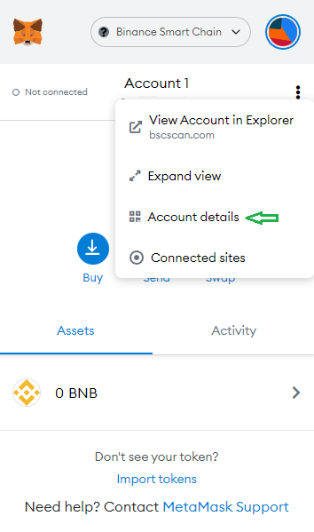
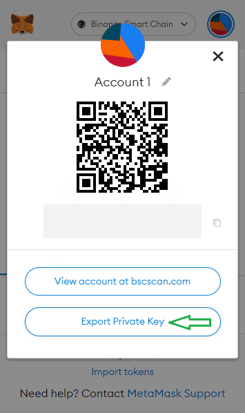
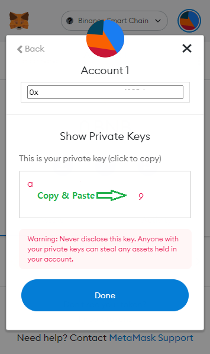

## EntroBeam - Entropy Miner

### Overviw
To quote the Bitcoin whitepaper: “The steady addition of a constant of amount of new coins is analogous to gold miners expending resources to add gold to circulation. In our case, it is CPU time and electricity that is expended.” And In EntroBeam, "In our case, it is blockchain gas fee that is expended."

To solve the deterministic problem in a decentralized system, EntroBeam presents a set to be used as an Entropy, and the user continuously transmits a noise(Not only that, but it also includes the meaning of seed. 256bits hexadecimal string) that does not allow duplicates.

Entropy miner continuously sends 256bits entropy seed to the entrobeam main contract for each block. Since the gas fee is consumed every block it is executed, the user must deposit sufficient funds in the account.

### Getting started
1. Install Python
```sh
$ sudo apt update
$ sudo apt install python3
$ sudo apt install python3-pip
```
APT will automatically find the package and install it on your computer. Depending on your OS package, python may be pre-installed.
2. Install dependencies
```sh
$ pip install web3
$ pip install getpass_asterisk
```
3. Get files and Run miner
```sh
$ mkdir EntropyMiner
$ cd EntropyMiner
$ wget https://raw.githubusercontent.com/entroBeam/contracts/main/EntropyMiner/EntropyMiner.py
$ wget https://raw.githubusercontent.com/entroBeam/contracts/main/EntropyMiner/EntroBEAM_ABI.py
$ python3 EntropyMiner.py
```
4. Stop mining
`ctrl`+`c`

### Useage
When you run miner, you will be prompted for
* Please enter your Web3.HTTPProvider :
* Please enter your Address :
* Please enter the above address secret key :
---
1. Web3.HTTPProvider
Use a provider to handle interactions with an HTTP or HTTPS-based JSON-RPC server. This example uses [Moralis](https://moralis.io/).
Please enter your Web3.HTTPProvider :








---
2. Address (public key, public address)
Please enter your Address :


---
3. Secret key
Please enter the above address secret key :






---

### Security note
Your device must be secure as your private key can use all the permissions of each account.
You must be able to be sure that anti-ware, viruses, etc., are not on your device.
And no one will ask for your private key. Key management forms the basis of all data security. As a general rule, pay attention to private key management.
